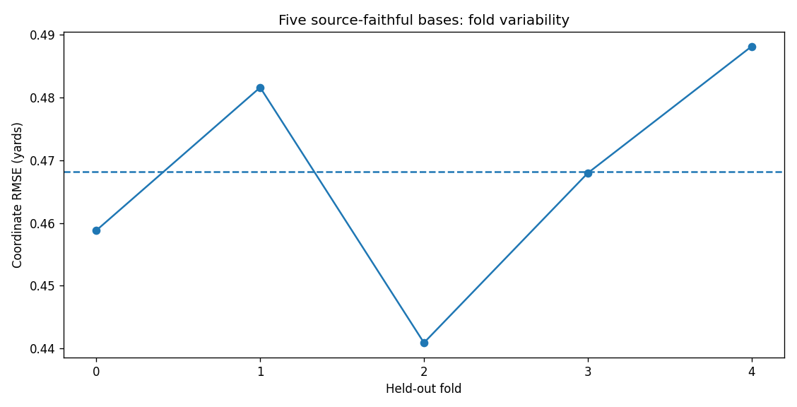

# NFL Big Data Bowl 2026 — Prediction

**Player-motion forecasting with temporal convolutions, cross-player attention, domain-informed geometry, and reproducible AWS research.**

[Latest model review](research/RECENT_MODELS.ipynb) · [Earlier feature research](research/RESEARCH_REVIEW.ipynb) · [Run and reproduce](START_HERE.md) · [Model card](docs/MODEL_CARD.md)

Predict selected players' future x/y locations after a pass using observed tracking, organizer-supplied landing location, player roles, and forecast horizon. This is the **Prediction** task, not the separate Analytics track.

## Latest research snapshot

Five source-faithful base models are trained and preserved. A geometric ROT variant passed its discovery gate but did not replicate under a fixed second-fold protocol. The current deployment candidate therefore retains the five base models, without unpromoted variants.

| Evidence | Coordinate RMSE, yards | Meaning |
|---|---:|---|
| **Five-fold base OOF** | **0.468143852** | 561,607 retained rows; each row predicted only by its excluded-fold model. Checkpoints selected on these folds. |
| Fold-1 base → fixed 50/50 base + ROT | 0.481571182 → 0.478225987 | Discovery passed the predeclared improvement and paired-game interval gates. |
| Fold-2 base → fixed 50/50 base + ROT | 0.440936133 → 0.441093137 | Fixed epoch-22 confirmation failed; ROT was not promoted. |
| Historical Kaggle private submission | 0.70090 | Earlier model, after the deadline; no official rank claimed. |

**No new Kaggle score is claimed for the five-base candidate.** Local OOF, historical private scoring, and the historical 0.46340 private-score target are different evaluation settings. The new candidate must pass saved-prediction replay and the official runtime before its score can be compared on Kaggle.

The [executed model review](research/RECENT_MODELS.ipynb) contains inline Plotly figures with static fallbacks, fold variability, paired-game uncertainty, and horizon error analysis. Its [aggregate evidence](research/evidence/model_reproduction.json) is inspectable without private data or cloud access.

## What the work demonstrates

- **Modeling:** grouped temporal convolutions, cross-player attention, positional and auxiliary Gaussian objectives, EMA checkpoints, and relative-motion features.
- **Experimental judgment:** game-grouped validation, fixed replication protocols, paired-game intervals, retained negative findings, and error-driven research decisions.
- **Engineering:** byte-pinned checkpoints, schema-aware provenance verification, label-free inference, ordered output contracts, bounded execution, and restartable receipts.

## A clear path through the evidence

Start with [Recent Models](research/RECENT_MODELS.ipynb) for the reproduced-model study and deployment boundary. Continue to the [Research Review](research/RESEARCH_REVIEW.ipynb) for earlier feature-family experiments, [research guide](research/README.md), and [frozen workspace archive](research/workspace/README.md) for preserved methods. Maintained forecasting code and tests remain in `src/` and `tests/`.

The first inference-export attempt passed 39 software tests but stopped before replay because its lineage validator assumed the wrong historical metadata schema. The corrective work separates each checkpoint's training-cache fingerprint from the shared evaluation cache and checks the continuation trainer in its recorded field. The corrected GPU replay is pending at this snapshot; an early stop is not advertised as a successful deployment.

## Validation and limitations

The metric is `sqrt(sum(dx² + dy²) / (2N))`, in yards. Pooled OOF is computed from row-weighted squared errors, not an unweighted mean of fold RMSEs. Fold checkpoint selection and repeated research inspection limit independence. Source-faithful normalization constants come from the archived upstream implementation, rather than being newly fitted inside each fold. Five source-excluded plays and unsupported raw-input cases remain coverage concerns. The complete winning ensemble has not been reproduced.

Earlier results on other populations remain in the [historical submission record](docs/results/kaggle_submission.json), [temporal evaluation record](docs/results/final_evaluation.json), and [recovery notes](docs/RECOVERY_STATUS.md). They are not pooled with the newer folds.

## Reproducibility, privacy, and attribution

**AWS and GitHub have different roles.** AWS retains raw competition data, fitted weights, private execution state, and uncommitted research. GitHub contains selected source, aggregate receipts, notebooks, and documentation; it is not an AWS mirror. Quality checks do not retrain models or prove a new competition score.

The project-side reproduction follows the public [chack3 training reference](https://www.kaggle.com/code/chack3/nfl2026-1st-place-train), with its provenance and limitations documented in the notebook. Original repository code uses MIT; referenced upstream materials retain their own licenses. Competition data has separate terms and is not redistributed. See the [data card](docs/DATA_CARD.md), [sources](docs/SOURCES.md), and [competition](https://www.kaggle.com/competitions/nfl-big-data-bowl-2026-prediction).
