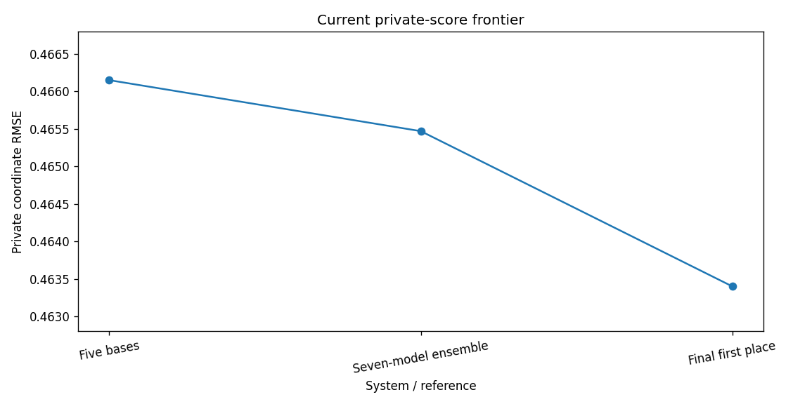

# NFL Big Data Bowl 2026 - Prediction

**Player-motion forecasting with temporal convolutions, cross-player attention, controlled augmentation, ensemble diversity, and reproducible AWS research.**

[Latest model review](research/RECENT_MODELS.ipynb) · [Earlier feature research](research/RESEARCH_REVIEW.ipynb) · [Run and reproduce](START_HERE.md) · [Model card](docs/MODEL_CARD.md)

Predict selected players' future x/y locations after a pass using observed tracking, organizer-supplied landing location, player roles, and forecast horizon. This is the **Prediction** task, not the separate Analytics track.

## Latest research snapshot

The current research line reproduces a source-faithful temporal/cross-player neural model, stress-tests complementary training and augmentation variants, and measures the resulting ensemble through the official Kaggle runtime. Five excluded-game base models remain the validated backbone. Seed diversity and protected context-player dropout did not pass their standalone replication/uncertainty gates, but both were retained as complementary models in one predeclared equal-weight seven-model ensemble.

That ensemble **improved the measured private RMSE from 0.46615 to 0.46547**. The official final first-place private score is **0.46340**, leaving a **0.00207 RMSE gap**. These are late post-competition submissions, so no official competition rank is claimed.

| Evidence | Coordinate RMSE, yards | Meaning |
|---|---:|---|
| **Five-fold base OOF** | **0.468143852** | 561,607 retained rows; each row predicted only by its excluded-game model. |
| Seed-1 Fold-0 base → fixed 50/50 blend | 0.458822850 → **0.453926574** | Discovery gain +0.004896276; paired-game interval positive. |
| Seed-1 Fold-1 base → fixed 50/50 blend | 0.481571182 → **0.478239278** | Point gain +0.003331904, but the paired-game interval crossed zero; no confirmation. |
| Context-dropout Fold-0 base → fixed 50/50 blend | 0.458822850 → **0.455515340** | Point gain +0.003307510, but uncertainty gate failed; not promoted alone. |
| Five-base Kaggle private submission | **0.46615** | First scored source-faithful deployment candidate. |
| **Seven-model Kaggle private submission** | **0.46547** | Equal 1/7 ensemble: five bases + seed-1 Fold 0 + context-dropout Fold 0. |
| Final first-place private score | **0.46340** | Comparable private-leaderboard target; late submissions receive no official rank here. |

The seven-model result reduced the remaining private-score gap by roughly **25%**, from 0.00275 to 0.00207. Its local pre-submission proxy improved by 0.003556053 with a paired-game interval of +0.001847278 to +0.005319216; the smaller leaderboard gain is retained as evidence that local screening was directionally useful but optimistic.

The [executed model review](research/RECENT_MODELS.ipynb) contains persisted inline Plotly figures with static fallbacks, fold variability, experiment uncertainty, horizon error analysis, and the private-score progression. The [aggregate evidence](research/evidence/model_reproduction.json) is inspectable without private data, player identities, or fitted weights.

## What the work demonstrates

- **Modeling:** grouped temporal convolutions, cross-player attention, relative-motion geometry, Gaussian auxiliary objectives, EMA inference, training-seed diversity, and controlled player-context dropout.
- **Scientific judgment:** game-grouped validation, fixed replication protocols, paired-game bootstrap intervals, explicit promotion gates, and negative-result preservation.
- **Ensembling:** complementary models are retained based on error diversity rather than standalone score alone; the first heterogeneous neural ensemble produced a verified private-score improvement.
- **Engineering:** byte-pinned checkpoints, schema-aware provenance, label-free inference, exact producer-schema contracts, restartable cloud checkpoints, duplicate-safe Kaggle journaling, and executed notebook/Plotly gates.

## Research progression and next frontier

The project has moved from a five-model reproduction to a measured seven-model ensemble. ROT geometry, mirrored inference, seed diversity, and context dropout all generated useful evidence; directions that failed locked confirmation rules were not silently promoted. The next prepared experiment is a **second game-grouped cross-validation split family**, designed to test the larger ensemble-diversity mechanism used by leading public systems. It is **prepared but not yet executed**, so no alternate-CV gain is claimed in this repository snapshot.

If alternate split diversity is insufficient, the next structural gap is not another ordinary seed: it is the broader pretraining / multi-auxiliary transformer and feature-diverse ensemble family described by medal-level public solutions.

## A clear path through the evidence

Start with [Recent Models](research/RECENT_MODELS.ipynb) for the current reproduced-model study, diversity experiments, and private-score progression. Continue to [Research Review](research/RESEARCH_REVIEW.ipynb) for the earlier feature-engineering system, the [research guide](research/README.md), and the [frozen workspace archive](research/workspace/README.md) for preserved methods. Maintained forecasting code and tests remain in `src/` and `tests/`.

The repository intentionally retains engineering failures that changed the system: historical checkpoint metadata required schema-aware lineage verification; raw-input replay required matched execution context; producer prediction files required explicit per-artifact schemas; score retrieval had to rely on durable remote receipts rather than ephemeral `/tmp` staging. Each class received regression coverage rather than being hidden from the research record.

## Validation and limitations

The metric is `sqrt(sum(dx² + dy²) / (2N))`, in yards. Pooled OOF is computed from row-weighted squared errors, not an unweighted mean of fold RMSEs. Checkpoint selection and repeated research inspection limit independence. Seed and context variants were explored on previously inspected folds, and the seven-model local proxy represented five deployed base members using the excluded Fold-0 base prediction. Its Kaggle score is therefore the authoritative measurement of the deployed ensemble.

Source-faithful normalization constants come from the archived upstream implementation rather than being newly fitted within each fold. The complete leading ensemble has not been reproduced. The current 0.46547 private score remains above 0.46340.

## Reproducibility, privacy, and attribution

**AWS and GitHub have different roles.** AWS retains raw competition data, fitted weights, private execution state, and large checkpoint archives. GitHub contains selected source, aggregate receipts, executed notebooks, figures, and documentation; it is intentionally not an AWS mirror.

The neural reproduction follows the public [chack3 training reference](https://www.kaggle.com/code/chack3/nfl2026-1st-place-train), with provenance and limitations documented in the notebook. Public solution writeups are used to identify testable mechanisms such as player dropout and cross-validation diversity; they are independently adapted and evaluated here rather than copied. Original repository code uses MIT; referenced upstream materials retain their own licenses. Competition data has separate terms and is not redistributed. See the [data card](docs/DATA_CARD.md), [sources](docs/SOURCES.md), [current submission record](docs/results/frontier_submission.json), and [competition](https://www.kaggle.com/competitions/nfl-big-data-bowl-2026-prediction).
