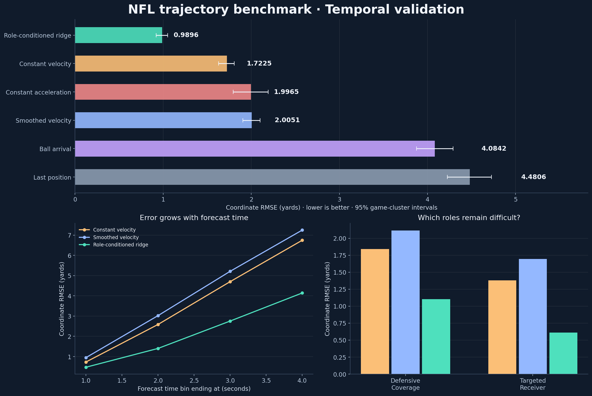

# NFL Player Trajectory

Forecast player movement after the throw using observed motion, the supplied ball
landing point, and player roles. This project combines a reproducible temporal
benchmark, interpretable vector models, animated field reports, and durable AWS
checkpoints.

[](https://github.com/alvaromendizabal/nfl-player-trajectory/actions/workflows/ci.yml)

**Phase 1 result:** a training-only role-conditioned ridge model achieved **0.9896
coordinate RMSE (yards)** on **32 later games**, compared with **1.7225** for constant
velocity: **42.6% lower RMSE**. The 48-game holdout remains unscored. These are local
validation results, not Kaggle leaderboard scores.



| Model | Coordinate RMSE / yd | ADE / yd | FDE / yd |
| --- | ---: | ---: | ---: |
| Role-conditioned ridge | **0.9896** | **0.8847** | **1.5057** |
| Constant velocity | 1.7225 | 1.5142 | 2.8696 |
| Constant acceleration | 1.9965 | 1.3073 | 2.6664 |
| Smoothed velocity | 2.0051 | 1.8581 | 3.3798 |
| Ball arrival | 4.0842 | 3.8607 | 5.6192 |
| Last position | 4.4806 | 4.4882 | 6.5526 |

All models score the same 67,857 player-frame positions. The ridge model's 95%
game-cluster bootstrap interval is **0.9218–1.0519 yards**. See the
[model card](docs/MODEL_CARD.md), [machine-readable results](docs/results/summary.json),
and [validation evidence](docs/VALIDATION.md).

## Explore the notebooks

- [00 · Project readiness](notebooks/00_project_readiness.ipynb): environment, metric, and synthetic orientation.
- [01 · Data analysis](notebooks/01_data_analysis.ipynb): actual data coverage, frozen dates, and training distributions.
- [02 · Motion benchmarks](notebooks/02_motion_benchmarks.ipynb): scores, uncertainty, failure slices, and learned weights.

The notebooks include rendered outputs for GitHub readers. They read local benchmark
artifacts when available and otherwise the explicitly labeled published experiment
snapshot. Open `artifacts/benchmark/report.html` after running the benchmark for the
offline report and animated validation play.

## Reproduce

For an existing installation with a completed audit:

```bash
git pull --ff-only origin main
python3 scripts/bootstrap.py
.venv/bin/nfl benchmark
.venv/bin/python kaggle/export.py --model role_ridge
.venv/bin/nfl backup
.venv/bin/nfl status
```

For initial environment, data access, and browser sign-in, see [START_HERE.md](START_HERE.md).
Use the **Python (NFL Trajectory)** kernel in SageMaker. This phase runs on CPU.
Matplotlib was added to the pinned environment for rendered research figures;
`uv.lock` records all transitive versions. Existing data and checkpoints are preserved.

## Model and validation design

The learned model combines six equivariant vector features: terminal velocity,
five-frame least-squares velocity, terminal acceleration, and three polynomial-time
terms pointing toward the supplied landing point. Ridge weights are fitted by role;
an unseen role uses a global training fit. Training-RMS scaling and fixed regularization
use only training games. Coordinates share coefficients, preserving rotation and
translation equivariance.

| Partition | Dates | Games | Use |
| --- | --- | ---: | --- |
| Train | 2023-09-07–2023-12-03 | 192 | Features, scaling and coefficient fitting |
| Validation | 2023-12-04–2023-12-18 | 32 | Development comparisons and error analysis |
| Holdout | 2023-12-21–2024-01-07 | 48 | Reserved for locked model selection |

The official metric is

$$\mathrm{RMSE}=\sqrt{\frac{\sum_i[(\hat{x}_i-x_i)^2+(\hat{y}_i-y_i)^2]}{2N}}.$$

Additional metrics are frame- and trajectory-weighted ADE, trajectory-weighted FDE,
p95 displacement and coordinate MAE. Intervals resample whole games 2,000 times;
paired differences use the same sampled games. Errors are broken down by player
role and forecast time. Development scores can become optimistic under repeated
selection; the reserved holdout is the eventual final evaluation.

## Reliability and recovery

- Explicit numerical, leakage, geometry, export, notebook, and recovery tests.
- Ruff, mypy, warnings-as-errors tests, and GitHub Actions on branches and PRs.
- UTC JSONL logs, elapsed command/stage times, and a 15-second heartbeat.
- Weekly feature and sufficient-statistic checkpoints, atomic writes and process locks.
- Hash verification before reuse; changed inputs, numerical code or dependencies invalidate work.
- Corrupt or interrupted stages recompute while valid stages remain reusable.
- Private content-addressed S3 snapshots for data, models, reports and run logs.

The measured development run took **33.924 seconds** in the validation environment.
A repeat reused **all 33 numerical stages** and took **5.166 seconds**, including
report rendering. These timings depend on hardware and caching. Single-play inference
includes feature construction and prediction; see [latency measurements](docs/results/latency.json).
The unit/integration suite also forces interruptions and corrupts artifacts to verify recovery.

Read [recovery instructions](docs/RECOVERY.md) and the [research plan](docs/RESEARCH_PLAN.md).
Next are interaction features and stronger residual models, followed by temporal
neural models with full optimizer, scheduler and RNG checkpoint recovery.

## Kaggle and attribution

Source: Michael Lopez, Tom Bliss, Ally Blake, Yao Yan, Martyna Plomecka, and Addison
Howard. [NFL Big Data Bowl 2026 — Prediction](https://www.kaggle.com/competitions/nfl-big-data-bowl-2026-prediction). Kaggle, 2025.

The exporter creates a standalone inference notebook with embedded learned weights
and the organizer's evaluation interface. Its exported predictor is tested against
the package implementation. The official gateway and a leaderboard submission are
still pending. The competition ended; late-submission eligibility must be checked
in the authenticated account, and this historical project cannot earn a new medal.

Raw NFL data, credentials, cloud identifiers and private checkpoints are excluded
from Git. Published results contain aggregate measurements, figures and fitted
coefficients. The data page lists CC BY-NC 4.0 and competition rules also apply.
The MIT license covers original project code; it does not relicense NFL data or
third-party code. Hugging Face publication is reserved for a later documented release.
