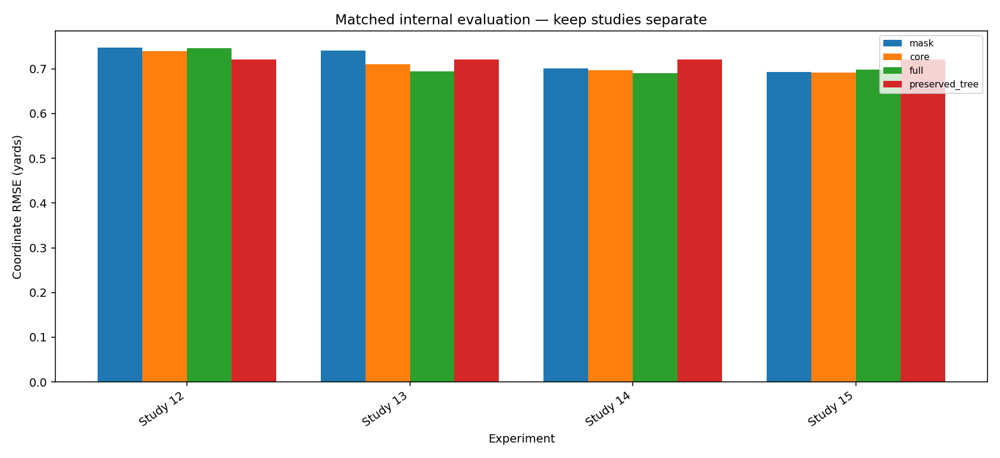

# NFL Big Data Bowl 2026 - Prediction

**Forecasting player motion after a pass with domain-informed features, temporal models, and reproducible experiment evidence.**

[Research review](research/RESEARCH_REVIEW.ipynb) · [Experiment source](research/workspace/README.md) · [Run and reproduce](START_HERE.md) · [Model card](docs/MODEL_CARD.md)

This project predicts selected players' future x/y locations from observed tracking, the organizer-supplied ball landing point, player role, and requested forecast horizon. It addresses the **NFL Big Data Bowl 2026 Prediction** task, not the separate Analytics track.

## What this project demonstrates

- **Domain-informed representation:** motion derivatives, landing-point geometry, receiver-relative dynamics, observed player relationships, and strictly earlier-date histories.
- **Controlled experimentation:** temporal game splits, matched feature ablations, availability controls, whole-game uncertainty, role/horizon diagnostics, and retained negative findings.
- **Reliable execution:** bounded CPU work, source/input fingerprints, resumable checkpoints, saved prediction replay, and separation of private competition data from public evidence.

## Read the results correctly

| Evidence | Coordinate RMSE, yards | Interpretation |
|---|---:|---|
| Repository-recorded Kaggle private submission | **0.70090** | Historical after-deadline submission; no official competition rank is claimed. |
| Reserved temporal evaluation | **0.80467** | Different data from Kaggle; already inspected, not an untouched set for later work. |
| Historical motion/tree blend | **0.62708** | Earlier internal result with incomplete checkpoint/source recovery; not a current reproducible release. |

These figures come from the existing [submission record](docs/results/kaggle_submission.json), [evaluation record](docs/results/final_evaluation.json), and [recovery documentation](docs/RECOVERY_STATUS.md). **No new Kaggle score is implied by this publication.**

The [public research review](research/RESEARCH_REVIEW.ipynb) reads the latest allowlisted aggregate receipts copied from the owner's AWS workspace at publication time. It shows each experiment separately rather than mixing scores from different populations. An improved mean score does not establish a retained feature when its predeclared uncertainty or replication gate fails.

The historical **0.46340 private-score target remains unmet**. Feature research is open. The present contribution is a transparent, inspectable forecasting and research workflow—not a claim of competition-leading accuracy.

## Start with the evidence

| Artifact | Purpose |
|---|---|
| [Research review notebook](research/RESEARCH_REVIEW.ipynb) | Inline Plotly charts of matched results, uncertainty, horizon errors, training/evaluation gaps, and readiness. No private data required. |
| [Aggregate evidence](research/evidence/studies.json) | Metrics and source-summary hashes, without individual forecasts or identities. |
| [Research guide](research/README.md) | Publication boundaries, reproduction requirements, and next scientific decisions. |
| [Experiment source archive](research/workspace/README.md) | Original named source packages and output-stripped notebooks. Python source bytes are preserved where safe. |
| [Original motion benchmark](notebooks/02_motion_benchmarks.ipynb) | Earlier controlled experiments and historical diagnostics. |

*Matched internal results only; the full notebook preserves confidence intervals and failed gates.*

## Validation and limits

The primary metric is `sqrt(sum(dx² + dy²) / (2N))`. Errors are in yards; lower is better. Paired confidence intervals resample games, not independent frames. Feature engineering is restricted to prediction-time information; learned transformations belong inside the training partition.

Recent feature screens repeatedly use the same internal game splits and one seed. They are exploratory, not independent final confirmation. The reported training-label coverage identifies additional usable training data, but this publication does not run a data-scale experiment or fit another model. Detailed limitations remain attached to each experimental protocol.

## Reproducibility and quality

Maintained forecasting code remains under `src/`, with its existing tests and **Quality** workflow unchanged. Frozen manual experiments live under `research/workspace/`; they are not promoted into the production package simply because they are published. Formatting them would alter their historical fingerprints, so they have a separate publication gate for Python syntax, notebook structure, file hashes, privacy exclusions, and aggregate metric arithmetic. Their scientific tests are **not rerun** by that archive gate.

Original AWS folders, data, credentials, private contracts, fitted weights, row-level errors, and notebook outputs remain private. Archive notebooks have outputs removed deliberately. The new Research Review is rendered from public aggregates only; its execution is documented separately from any model training.

## Data and license

Code uses the repository's MIT license. Competition data has separate terms and is not redistributed. See the [data card](docs/DATA_CARD.md), [sources](docs/SOURCES.md), and [competition page](https://www.kaggle.com/competitions/nfl-big-data-bowl-2026-prediction).
