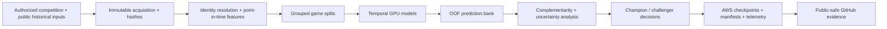

# NFL Big Data Bowl 2026 - Player Trajectory Prediction

**End-to-end machine learning research for forecasting NFL player motion with temporal deep learning, grouped-CV ensembles, direct-source historical context, GPU optimization, and reproducible AWS experimentation.**

[60-second review](#60-second-review) · [Engineering case study](docs/EMPLOYER_CASE_STUDY.md) · [Current research status](docs/CURRENT_RESEARCH_STATUS.md) · [Feature-diversity study](docs/FEATURE_DIVERSITY_STUDY.md) · [Research system](docs/RESEARCH_SYSTEM.md) · [Model card](docs/MODEL_CARD.md) · [Start here](START_HERE.md)

---

## 60-second review

This project demonstrates **end-to-end ownership of a serious ML research system**: data acquisition, temporal modeling, validation design, ensemble construction, GPU performance engineering, experiment orchestration, reproducibility, and scientific decision-making.

### Headline results

| Evidence | Result |
|---|---:|
| Strongest completed local ensemble | **0.4631723213 pooled OOF RMSE** |
| OOF evaluation population | **561,607 scored rows / 272 games** |
| Accepted ensemble | **20 models / 4 grouped split families** |
| Strongest recorded private submission | **0.46487 RMSE** |
| Two-to-four-family OOF gain | **0.00217835 RMSE** |
| Original folds improved in diversity audit | **5 / 5** |
| Leave-one-game-out direction | **272 / 272 positive** |
| Measured fixed-ensemble inference acceleration | **4.784×** with exact declared-benchmark parity |
| Direct NFL NGS acquisition | **3,920 rows / 691 historical players** |
| Direct ESPN acquisition | **36 scoreboards / 544 game summaries / 272 of 272 games mapped** |
| Confirmation-stage challenger | **0.44850 RMSE vs 0.45373 incumbent on a 109,144-row development fold; separate-fold confirmation pending** |

Local OOF, individual-fold validation, confirmation-stage evidence, and private-submission evidence are intentionally treated as separate evaluation settings.

### What I built

- **Temporal deep-learning models** for multi-player trajectory forecasting
- **20-model ensemble infrastructure** across repeated grouped cross-validation families
- **direct NFL and ESPN historical-data pipelines** with identity resolution and point-in-time leakage controls
- **OOF prediction banks and complementarity analysis** for evidence-based ensemble decisions
- **resumable AWS/SageMaker GPU training runners** with model/optimizer/EMA/scaler/RNG checkpoint recovery
- **instance-aware performance benchmarks** for loader workers, CPU threads, batching, precision, caching, and inference preparation
- **structured experiment telemetry** covering runtime, GPU/CPU/RAM/disk utilization, throughput, and cost estimates
- **fail-closed research gates** for hashes, schemas, metric parity, checkpoints, notebooks, and packaging
- **negative-result retention and regression testing** so failed hypotheses and avoidable execution errors are not repeated

## Technical stack

| Area | Technologies |
|---|---|
| Modeling | Python, PyTorch, temporal convolution, attention / player interaction, Gaussian trajectory objectives, EMA |
| Data | pandas, NumPy, scikit-learn, direct public NFL/ESPN sources, point-in-time feature engineering |
| Cloud / GPU | AWS SageMaker, NVIDIA L4, CUDA mixed precision, boto3 |
| Validation | grouped cross-validation, pooled OOF, paired-game bootstrap, fixed promotion gates |
| Visualization | Plotly, Jupyter |
| Engineering | pytest, Ruff, mypy, GitHub Actions, immutable manifests, structured JSONL logging |

## System architecture

```mermaid
flowchart LR
    A[Authorized competition + public historical inputs] --> B[Immutable acquisition + hashes]
    B --> C[Identity resolution + point-in-time features]
    C --> D[Grouped game splits]
    D --> E[Temporal GPU models]
    E --> F[OOF prediction bank]
    F --> G[Complementarity + uncertainty analysis]
    G --> H[Champion / challenger decisions]
    H --> I[AWS checkpoints + manifests + telemetry]
    I --> J[Public-safe GitHub evidence]
```

AWS SageMaker is the canonical research environment. GitHub is the durable, employer-facing implementation and reproducibility layer.

## Why the ensemble work matters

The strongest transferable system result is **diversity across grouped split families**.

A full-OOF audit reproduced the accepted 20-model system at **0.4631723213 RMSE** across **561,607 rows and 272 games**. Expanding from two to four split families improved OOF RMSE by **0.00217835** with a paired-game 95% interval of **[0.000629, 0.003861]**.

That improvement was broad rather than driven by one convenient slice:

- **5/5** original folds improved
- the direction stayed positive after **272/272** single-game removals
- all non-empty family subsets were evaluated rather than selecting a favorable subset after the fact

This led to a bounded fresh-split pilot rather than indiscriminate model scaling.

## Latest confirmation-stage study

A later controlled study tested **feature-configuration diversity** while holding the core architecture, training maturity, evaluation population, and fixed blend policy constant.

On the development fold, the fixed feature-diversity portfolio improved the incumbent from **0.45372575 to 0.44849765 RMSE**. The adjusted whole-game intervals for improvement were positive against both the incumbent and a maturity-matched native-control blend. The direction remained positive after every single-game removal, and all displayed horizon bands improved.

This result is intentionally labeled **confirmation-stage**, not promoted. The next gate uses a different grouped validation fold, fresh model initialization, and no discovery-fold weight reuse.

See [Feature-diversity confirmation study](docs/FEATURE_DIVERSITY_STUDY.md).

## Research discipline

The project deliberately separates **component quality** from **system value**.

Several candidates improved standalone fitting but failed to add enough independent residual signal to the ensemble. Those exact recipes were retired rather than repeatedly rescued with small learning-rate, hidden-size, epoch, or blend-weight changes.

Promotion decisions use:

- game-grouped validation
- exact coordinate RMSE
- fixed, predeclared blend weights
- paired whole-game bootstrap uncertainty
- screen / midpoint / final spending gates
- standalone-versus-ensemble attribution
- full-OOF confirmation before scaling
- point-in-time external-data construction
- immutable checkpoint and source lineage

The latest feature-diversity challenger passed its predeclared development-fold gate and is now **awaiting separate-fold confirmation**. It is not part of the accepted system until that confirmation and full pooled-OOF requirements are satisfied. Recent execution state and measured evidence are documented in [Current research status](docs/CURRENT_RESEARCH_STATUS.md).

## Direct-source historical data engineering

Historical context is accepted only when it can be acquired directly from a first-party or neutral public source and transformed into a point-in-time-safe representation.

### NFL Next Gen Stats

- **3,920** historical rows
- **691** historical players
- **401** competition-player matches
- **95.74%** passer-prior coverage
- **85.35%** targeted-receiver-prior coverage

### ESPN

- **36/36** weekly scoreboards
- **544/544** game summaries
- **272/272** competition games mapped
- **100%** play-team mapping
- **97.15%** player-prior coverage
- **100%** dual team-PBP coverage

For a 2023 competition play in week `w`, 2023 historical features may only use observations from weeks `< w`.

See [External data engineering](docs/EXTERNAL_DATA_ENGINEERING.md).

## GPU and research-systems engineering

The canonical research stack runs on AWS SageMaker with a single NVIDIA L4.

Measured and implemented capabilities include:

- **4.784×** shared-preparation inference acceleration with exact parity on the declared benchmark
- resumable model / optimizer / EMA / scaler / RNG checkpointing
- workload-specific `DataLoader` and CPU-thread benchmarking
- mixed precision where numerically valid and FP32 evaluation where required
- CPU / RAM / GPU / disk utilization heartbeats and peak-memory tracking
- structured JSONL plus human-readable logs
- reconstructable run-cost estimates and explicit runtime ceilings
- fail-closed schema, source-hash, checkpoint, metric, and packaging gates
- executed-notebook and Plotly persistence checks
- deterministic regression tests for avoidable execution failures

See [Research system and reproducibility](docs/RESEARCH_SYSTEM.md).

## Employer-facing engineering case study

The concise case study explains the project as a production-minded ML system rather than a sequence of competition experiments:

**[Read the engineering case study →](docs/EMPLOYER_CASE_STUDY.md)**

It covers the problem, ownership scope, architecture, modeling strategy, validation design, measurable outcomes, reliability engineering, reproducibility boundary, and the technical decisions most relevant to ML engineering and applied-science roles.

## Public reproducibility boundary

This repository is intentionally **semi-reproducible**.

### Published

- selected implementation
- aggregate metrics
- validation and metric contracts
- tests and selected protocols
- public-safe notebooks
- provenance patterns
- architecture and systems documentation
- machine-readable result snapshots
- research decisions and negative-result summaries

### Kept private

- raw competition data
- raw third-party response archives
- fitted weights and large checkpoints
- credentials
- private cloud object locations
- complete private runners
- row-level private predictions
- unreleased active feature combinations

The public surface is designed to make the engineering, science, and reproducibility discipline reviewable without redistributing restricted data or active competitive IP.

## Review paths

### Recruiter / hiring manager — ~2 minutes

1. This README
2. [Engineering case study](docs/EMPLOYER_CASE_STUDY.md)

### ML engineer / applied scientist — ~10 minutes

1. [Current research status](docs/CURRENT_RESEARCH_STATUS.md)
2. [Research system and reproducibility](docs/RESEARCH_SYSTEM.md)
3. [Model card](docs/MODEL_CARD.md)
4. [Feature-diversity confirmation study](docs/FEATURE_DIVERSITY_STUDY.md)
5. [October research review](docs/OCTOBER_RESEARCH_PROGRESS.md)

### Deep technical review

1. [Start here](START_HERE.md)
2. [Research evidence archive](research/README.md)
3. `src/nfl_trajectory/`
4. `tests/`
5. selected notebooks and public evidence

## Repository map

- `src/nfl_trajectory/` — maintained public implementation
- `tests/` — software and research-contract tests
- `notebooks/` — selected project notebooks
- `research/` — public research evidence and source archive
- `docs/` — model, validation, system, case-study, and data-engineering documentation
- `START_HERE.md` — reproducibility and reviewer entry point

## Metric and limitations

The official metric is coordinate RMSE:

`sqrt(mean((prediction_xy - target_xy)^2))`

Lower is better.

The labeled competition data cover one competition season, so cross-season generalization remains a research limitation. External-source coverage varies by player and source. Strong component models can remain redundant inside an ensemble. Development-fold evidence, pooled OOF, and private-submission measurements are never treated as interchangeable.

This repository is a research and engineering artifact, not a certified player-evaluation or production decision system.

---

**Competition:** NFL Big Data Bowl 2026 Prediction  
**Canonical research environment:** AWS SageMaker  
**Public repository role:** versioned, semi-reproducible employer-facing evidence
