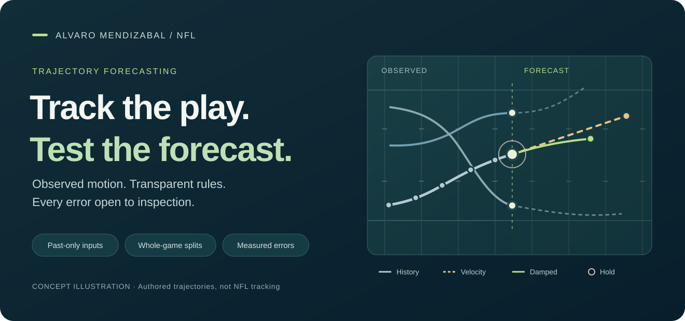

# NFL Big Data Bowl 2026 - Prediction

**Alvaro Mendizabal · Temporal ML · Evaluation design · GPU performance engineering**

Player trajectory forecasting for the [NFL Big Data Bowl 2026 prediction task](https://www.kaggle.com/competitions/nfl-big-data-bowl-2026-prediction).

[](https://github.com/alvaromendizabal/nfl-player-trajectory/actions/workflows/ci.yml)
[](https://github.com/alvaromendizabal/nfl-player-trajectory/actions/workflows/publication.yml)
[](https://github.com/alvaromendizabal/nfl-player-trajectory/actions/workflows/portfolio.yml)
[](https://github.com/alvaromendizabal/nfl-player-trajectory/actions/workflows/public-demo.yml)



I built a trajectory-forecasting research and delivery system: a **20-model temporal ensemble**, evaluation across **272 games**, recoverable training on one NVIDIA L4, and inference verified through the organizer gateway. My work covers modeling, historical-data integration, validation, performance optimization and evidence-based model selection.

**Recorded private coordinate RMSE improved from 0.70090 to 0.46468, a 33.7% reduction.** This summarizes successive project systems, not a single-component effect. The result is a late evaluation, not an official competition placement.

**Start here:** [Route Lab demo](https://alvaro-nfl-route-lab.tartmacaw2.chatgpt.site) · [Case study](docs/EMPLOYER_CASE_STUDY.md) · [Three-minute review](START_HERE.md) · [Run locally](docs/REPRODUCIBILITY.md)

## Try Route Lab

[Open the public demo](https://alvaro-nfl-route-lab.tartmacaw2.chatgpt.site) without installation. To run the same source locally, serve the checkout:

```bash
python -m http.server 8000
```

Open `http://localhost:8000/public-demo/`. Select a synthetic play and player, change the forecast horizon, and compare constant velocity, hold-last-position and damped-velocity forecasts. Scrub or animate the paths, inspect coordinate error and export the result. The browser computes each forecast from observed motion; future positions are used only for evaluation and display.

The trajectories are authored synthetic data. These transparent motion rules perform no neural-model inference, fitting or private-ensemble scoring. [Demo methods and verification](docs/REPRODUCIBILITY.md)

```bash
node tools/test_public_demo.mjs
```

## Results and decisions

| Measurement | Result | Scope |
|---|---:|---|
| Recorded private RMSE | **0.46468** | Late evaluation; submission **56928100** |
| Supported-population OOF RMSE | **0.4629258204** | 561,607 forecast rows |
| Full-population OOF RMSE | **0.5242026277** | All 562,936 forecast rows across 272 games |
| Inference acceleration | **4.784×** | Fixed-ensemble benchmark with exact prediction parity |

Lower coordinate RMSE is better. Out-of-fold (OOF) results use game-held-out models and are separate from private evaluation. The full population includes additional rare and long-horizon cases; its score is not directly comparable with the supported-only score. [Exact results and provenance](docs/RESULTS.md)

## Engineering decisions worth reviewing

- **Measure ensemble value.** Expanding two grouped split families to four improved an earlier matched OOF comparison by **0.00217835**; the direction remained positive after every single-game removal.
- **Include difficult cases.** Coverage checks retained long horizons and missing context, with keys and row counts verified through packaged inference.
- **Reuse expensive work.** Shared preparation accelerated inference; training checkpoints preserved optimizer, moving-average, scaler and random state.
- **Separate acquisition from predictive value.** NFL/ESPN identity bridges and earlier-week-only context were evaluated independently of model promotion.
- **Keep negative evidence.** Unconfirmed feature branches and stopped acquisition work remain documented rather than presented as delivered gains.

[Case study](docs/EMPLOYER_CASE_STUDY.md) · [Results](docs/RESULTS.md) · [Research archive](research/README.md)

## Run the public Python demonstration

With Python 3.11, no package installation, account, GPU or network access is needed:

```bash
python scripts/run_portfolio_demo.py --output demo_output
python -S scripts/validate_portfolio_release.py --demo-output demo_output
```

Open `demo_output/dashboard.html`. The unchanged Python example generates deterministic trajectories, compares two fixed forecasts, and writes a report, CSVs and hash-bound manifests. The browser adds interactive inspection and a damped-motion comparison. Synthetic metrics are separate from all historical scores. [Full setup and checks](docs/REPRODUCIBILITY.md)

## Completed scope

The project is complete as a research and engineering portfolio. Evidence from one labeled season and repeated validation inspection limits generalization claims. Historical notebooks and experiment pages retain their original context.

The public release contains selected implementation, tests, aggregate results, provenance and a small fitted baseline. Private neural weights, row-level private predictions, the latest private inference recipe and nonpublic execution bundles remain excluded. Published architectures and methods retain their [source credits](docs/SOURCES.md). [Closeout](docs/PROJECT_CLOSEOUT.md)
