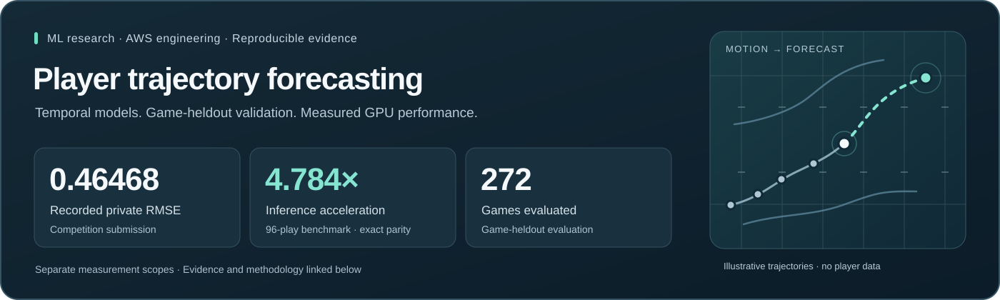
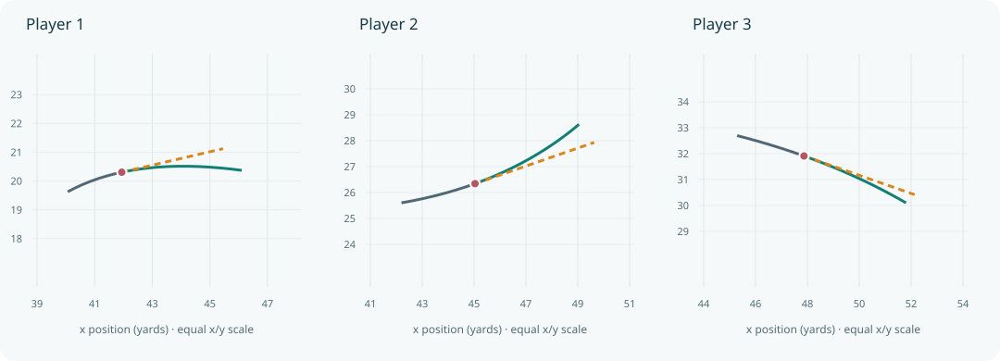

# NFL Big Data Bowl 2026 - Prediction



**An end-to-end ML project: temporal prediction, game-grouped validation, GPU performance engineering, and verified model delivery.**

[](https://github.com/alvaromendizabal/nfl-player-trajectory/actions/workflows/ci.yml)
[](https://github.com/alvaromendizabal/nfl-player-trajectory/actions/workflows/publication.yml)

[](https://github.com/alvaromendizabal/nfl-player-trajectory/actions/workflows/portfolio.yml)

[Case study](docs/EMPLOYER_CASE_STUDY.md) · [Results](docs/RESULTS.md) · [Reproducibility](docs/REPRODUCIBILITY.md) · [Review guide](START_HERE.md)

Built for the [NFL Big Data Bowl 2026 Prediction competition](https://www.kaggle.com/competitions/nfl-big-data-bowl-2026-prediction).

Forecasting an NFL player's path after a pass requires reasoning about recent motion, nearby players, and a variable prediction horizon. This project turns that problem into a complete research and delivery system: a **20-model temporal ensemble**, evaluation across **272 games**, resumable training on **one NVIDIA L4**, and an inference artifact verified through the competition gateway.

## Results at closeout

| Measurement | Result | Evaluation scope |
|---|---:|---|
| Best recorded private RMSE | **0.46468** | Kaggle late evaluation; submission **56928100** |
| Recorded private RMSE reduction across the project | **33.7%** | 0.70090 → 0.46468 across recorded submissions |
| Current policy, supported-population OOF RMSE | **0.4629258204** | 561,607 forecast rows |
| Current policy, full-population OOF RMSE | **0.5242026277** | All 562,936 forecast rows across 272 games |
| Scored ensemble | **20 models** | Four game-grouped split families |
| Measured inference acceleration | **4.784×** | Fixed-ensemble benchmark; exact prediction parity on that benchmark |

Lower coordinate RMSE is better. The 33.7% reduction summarizes progression across project systems; controlled effects are reported separately. The private result is a **recorded late-evaluation score, not an official competition placement**. Out-of-fold (OOF) results use game-held-out models and are separate from the private evaluation. The full population adds rare cases, including unusually long horizons; its score must not be compared directly with the supported-only score. Exact values and provenance are in [Results](docs/RESULTS.md) and the [sanitized evidence snapshot](docs/results/project_closeout.json).

## Engineering contributions

- **Validated ensemble diversity.** Expanding from two to four grouped split families improved the earlier supported-population OOF RMSE by 0.00217835; all five original folds improved, and the direction stayed positive after each of 272 single-game removals.
- **Complete inference coverage.** A policy study addressed output bounds, long forecast horizons, and missing-context cases. The accepted policy was carried through packaged inference, the organizer gateway, and a recorded private evaluation.
- **Efficient, recoverable GPU execution.** Shared inference preparation reduced repeated work. Training checkpoints preserved optimizer, moving-average, scaler, and random state; artifact hashes and resource checks protected expensive runs.
- **Historical data engineering.** Direct NFL and ESPN acquisition produced reusable provenance and identity bridges, with earlier-week-only features to prevent future information from entering historical context. Acquisition success and model improvement were evaluated separately.
- **Auditable experimentation.** Fixed comparisons, whole-game uncertainty estimates, negative-result retention, tests, and versioned evidence made promotion decisions reviewable.

The neural baseline builds on [chack3's public training reference](https://www.kaggle.com/code/chack3/nfl2026-1st-place-train). The project contribution is its reproduction, controlled extensions, data pipelines, validation, performance work, and reliable delivery. The source architecture is credited to its author. [Sources and attribution](docs/SOURCES.md) preserve the research lineage.

## Run the public demo



*An invented heldout play from the deterministic public demo. Slate shows observed motion; teal shows simulated future motion; dashed amber shows constant velocity; rose shows the last-position reference. These are synthetic trajectories, not NFL tracking or private-model predictions. The [preview receipt](docs/results/project_closeout.json) binds this graphic to its generator.*

From the repository root, with Python 3.11 or newer:

```bash
python scripts/run_portfolio_demo.py --output demo_output
```

Open demo_output/dashboard.html after the command finishes. The self-contained report visualizes deterministic synthetic trajectories and compares constant-velocity predictions with a hold-last-position reference. It needs no installation, credentials, GPU, network access, or competition data. It demonstrates the public workflow; it does not reproduce the fitted private ensemble or its reported score. See [Reproducibility](docs/REPRODUCIBILITY.md) for outputs and verification commands.

## Review the project

| Time | Review path |
|---|---|
| 2 minutes | [Engineering case study](docs/EMPLOYER_CASE_STUDY.md): problem, decisions, and outcomes |
| 10 minutes | [Results](docs/RESULTS.md) and [Reproducibility](docs/REPRODUCIBILITY.md): measured evidence and what runs publicly |
| Technical review | [Start here](START_HERE.md): implementation, tests, and selected research evidence |
| Final state | [Project closeout](docs/PROJECT_CLOSEOUT.md): delivered scope, limitations, and archived work |

Python and PyTorch power the research models; pandas and NumPy support the data pipeline. The engineering stack includes AWS SageMaker, CUDA, Jupyter/Plotly, automated tests, Ruff, mypy, and GitHub Actions. The public demo deliberately uses only Python's standard library.

## Reproducibility boundary

This repository publishes selected implementation, tests, aggregate results, provenance, and a small fitted baseline. Private neural champion weights, row-level private predictions, the latest production recipe, and nonpublic execution bundles are withheld. Historical source archives remain available as published research evidence. Reproducing the reported ensemble scores requires private research artifacts; the public demo and software checks run independently.

The project is closed as a documented research and engineering deliverable. The labeled season and repeatedly inspected validation data limit generalization claims. Historical experiment pages remain preserved as dated evidence; the closeout documents above define the final project state.
