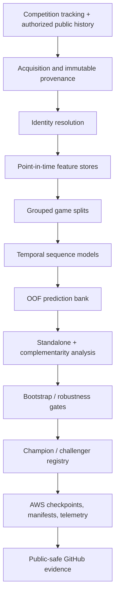

# Employer engineering case study

## Executive summary

This project is an end-to-end machine learning research system for forecasting NFL player trajectories after a pass.

The work spans **data acquisition, temporal modeling, grouped validation, ensemble research, GPU optimization, experiment orchestration, reproducibility, and scientific decision-making**.

The strongest completed local system is a **20-model ensemble across four grouped split families** with **0.4631723213 pooled OOF RMSE over 561,607 scored rows and 272 games**. The strongest recorded private submission is **0.46487 RMSE**; those evaluation settings are intentionally reported separately.

The project is designed to answer not only *whether a model improves*, but also:

- whether the improvement survives grouped validation
- whether it contributes independent ensemble signal
- whether uncertainty is acceptable
- whether the result is reproducible and resumable
- whether the compute cost is justified
- whether the evidence is strong enough to change the accepted system

## Ownership scope

The project demonstrates end-to-end ownership across the ML lifecycle.

### Data and feature engineering

- direct acquisition from public NFL and ESPN sources
- immutable raw-source provenance and hashes
- player/game identity resolution
- point-in-time historical feature construction
- leakage controls for current-week and future observations
- coverage audits by player role and source
- reusable cached feature stores

### Modeling

- temporal convolution over observed motion
- player-interaction attention
- static play/player context
- probabilistic trajectory supervision
- velocity / acceleration auxiliary supervision
- exponential moving-average weights
- geometric and temporal augmentation
- repeated grouped split families
- ensemble complementarity analysis

### Validation and research

- game-grouped cross-validation
- exact coordinate RMSE
- pooled out-of-fold evaluation
- fixed, predeclared blend weights
- paired whole-game bootstrap intervals
- screen / midpoint / final promotion gates
- residual-correlation analysis
- leave-one-game-out robustness checks
- negative-result retirement

### ML systems engineering

- AWS SageMaker as the canonical research environment
- NVIDIA L4 mixed-precision training
- resumable model / optimizer / EMA / scaler / RNG checkpoints
- collision-resistant run IDs
- immutable experiment manifests
- structured JSONL and human-readable logs
- CPU / RAM / GPU / disk telemetry
- measured throughput and cost accounting
- fail-closed integrity gates
- regression tests for avoidable execution failures

## Problem

The prediction task is multi-agent and temporal: forecast selected players' future x/y coordinates using observed tracking history and play context.

The main engineering difficulty is not just fitting a trajectory model. A credible system must handle:

- variable player sets
- variable forecast horizons
- correlated player movement
- grouped games and leakage risk
- multiple evaluation views
- high model-to-model residual correlation
- expensive GPU experimentation
- external historical context with identity and timestamp uncertainty

## System design

The system deliberately separates the **live scientific state** from the **public review layer**.

AWS retains private data, checkpoints, predictions, and experiment state. GitHub contains selected implementation, tests, aggregate metrics, architecture, provenance patterns, and research decisions.

## Strongest measured system evidence

### 20-model grouped-split ensemble

The accepted local ensemble uses **20 models across four grouped split families**.

Full pooled OOF:

- coordinate RMSE: **0.4631723213**
- scored rows: **561,607**
- games: **272**

### Diversity audit

A full-OOF audit compared the accepted four-family system with the earlier two-family system.

Measured incremental improvement:

**0.00217835 RMSE**

Paired-game 95% interval:

**[0.000629, 0.003861]**

Robustness checks:

- **5/5** original folds improved
- direction remained positive after **272/272** leave-one-game-out removals
- all non-empty family subsets were evaluated
- no learned post-hoc family weighting was required for the headline result

This was treated as evidence for controlled model-family expansion rather than a reason to scale blindly.

## Performance engineering

The project treats runtime as an ML systems problem, not an afterthought.

A shared-preparation inference path for the fixed 20-model system achieved a measured:

**4.784× speedup**

with exact prediction parity on the declared benchmark.

Other runtime practices include:

- benchmarking data-loader worker counts on the actual workload
- benchmarking CPU thread counts
- mixed precision only where numerically valid
- explicit FP32 evaluation when source parity requires it
- caching immutable preparation results
- resumable checkpoint boundaries
- GPU utilization and memory telemetry
- hard runtime / memory / disk gates

## Direct-source historical data

The project builds its own historical context rather than relying on competitor-prepared datasets.

### NFL Next Gen Stats

- 3,920 historical rows
- 691 historical players
- 401 competition-player matches
- 95.74% passer-prior coverage
- 85.35% targeted-receiver-prior coverage

### ESPN

- 36/36 weekly scoreboards
- 544/544 game summaries
- 272/272 competition games mapped
- 100% play-team mapping
- 97.15% player-prior coverage
- 100% dual team-PBP coverage

For a 2023 competition play in week `w`, 2023 historical features may only use weeks `< w`.

This constraint is enforced as a data-contract rule rather than left to analyst convention.

## Research decisions that mattered

### 1. Standalone improvement is not enough

Several candidates improved a matched component model but failed to add enough independent ensemble signal.

The project therefore evaluates both:

- standalone RMSE
- contribution to the fixed incumbent ensemble

This avoids promoting models that look strong in isolation but duplicate existing errors.

### 2. Negative experiments are assets

Failed scientific hypotheses are preserved and exact configurations are retired.

That prevents repeated compute on already answered questions and makes the research program cumulative.

### 3. Operational failures become tests

Avoidable execution failures are converted into deterministic regression tests before the next expensive run.

Examples include:

- live external-source schema drift
- timestamp/date semantics
- stale benchmark configuration
- duplicate telemetry fields
- prediction-column mismatch
- source evaluation precision mismatch

This turns expensive failures into durable reliability improvements.

### 4. Reproducibility includes state

A training checkpoint is not treated as only model weights.

Where required, resume state includes:

- model
- optimizer
- EMA
- gradient scaler
- random state
- epoch / batch cursor
- metric history
- source/config identity

This preserves experiment meaning across interrupted GPU sessions.

## Current research lifecycle

The accepted 20-model ensemble remains the completed local system.

The current fresh grouped-split challenger is explicitly labeled **experimental** until its prespecified validation is complete.

The public repository does not present "most recent" as equivalent to "best." Model states are evidence-driven:

`EXPERIMENTAL → VALIDATED → PROMOTED → CHAMPION`

with terminal states such as:

`REJECTED · BLOCKED · FAILED · RETIRED`

## Technology map

| Capability | Technologies / methods |
|---|---|
| Deep learning | PyTorch, temporal convolution, attention, Gaussian objectives, EMA |
| Data science | Python, pandas, NumPy, scikit-learn |
| Cloud | AWS SageMaker, boto3 |
| GPU | NVIDIA L4, CUDA mixed precision |
| Validation | grouped CV, pooled OOF, bootstrap uncertainty |
| Research ops | checkpoints, immutable manifests, champion/challenger registry |
| Quality | pytest, Ruff, mypy, GitHub Actions |
| Analysis | Jupyter, Plotly |
| Observability | JSONL logs, utilization telemetry, throughput and cost tracking |

## What this project demonstrates to employers

### Machine Learning Engineer

- model development plus production-minded training infrastructure
- GPU performance engineering
- resumable experiment systems
- validation and deployment discipline
- cloud-native ML workflow ownership

### Applied Scientist / Research Engineer

- controlled experiments and ablations
- uncertainty-aware promotion criteria
- ensemble complementarity analysis
- negative-result retention
- rigorous distinction between evaluation settings

### Data Scientist

- messy external data acquisition
- identity resolution
- point-in-time feature engineering
- grouped validation
- interpretable decision history

### Senior technical ownership

- research prioritization under compute constraints
- evidence-based stopping rules
- public/private reproducibility design
- debugging across data, model, numerical, and systems layers
- converting one-off experiments into reusable infrastructure

## Public reproducibility boundary

The public repository intentionally exposes enough to review the system without publishing restricted data or active competitive IP.

### Public

- selected source implementation
- tests
- validation contracts
- aggregate metrics
- system architecture
- provenance patterns
- research decisions
- machine-readable public snapshots
- public-safe notebooks

### Private

- raw competition data
- raw third-party response archives
- fitted weights
- large checkpoints
- private cloud paths
- complete private runners
- row-level private predictions
- unreleased active feature combinations

## Suggested interview discussion

The most technically representative discussion areas are:

1. **Why grouped split diversity improved the full ensemble**
2. **Why strong standalone candidates can fail ensemble promotion**
3. **How point-in-time historical data prevents subtle leakage**
4. **How the 4.784× inference speedup preserved exact prediction parity**
5. **How checkpoint state was designed for true interrupted-run recovery**
6. **How avoidable failures were converted into regression tests**
7. **How the public/private boundary preserves reviewability without exposing restricted artifacts**

## Review next

- [README](../README.md)
- [Current research status](CURRENT_RESEARCH_STATUS.md)
- [Research system and reproducibility](RESEARCH_SYSTEM.md)
- [Model card](MODEL_CARD.md)
- [External data engineering](EXTERNAL_DATA_ENGINEERING.md)
- [Research evidence archive](../research/README.md)
