# Research system and reproducibility

## Overview

This project is designed as an ML research system, not a collection of disconnected competition notebooks.

The operating architecture separates the live AWS research environment from the public GitHub evidence layer.

```mermaid
flowchart LR
    A[Authorized raw inputs] --> B[Immutable acquisition + hashes]
    B --> C[Point-in-time preprocessing]
    C --> D[Grouped split definitions]
    D --> E[GPU training / inference]
    E --> F[OOF prediction bank]
    F --> G[Fixed gates + bootstrap uncertainty]
    G --> H[Champion / challenger registry]
    H --> I[AWS immutable run evidence]
    I --> J[Public-safe GitHub artifacts]
```

AWS SageMaker remains the canonical source of truth for data, training, predictions, checkpoints, and run evidence. GitHub contains the durable public implementation and reproducibility record derived from validated milestones.

## Metric contract

Primary metric:

`sqrt(mean((prediction_xy - target_xy)^2))`

Lower is better.

The project keeps individual-fold validation, pooled OOF, and private submission evidence distinct. Promotion decisions are evaluated only in their declared setting.

## Research lifecycle

Important candidates move through explicit lifecycle states:

`EXPERIMENTAL → VALIDATED → PROMOTED → CHAMPION`

Terminal non-promotion states include `REJECTED`, `BLOCKED`, `FAILED`, and `RETIRED`.

A run completing successfully does not automatically become a better model.

## Validation design

The main research controls are:

- games are the grouping unit for cross-validation
- learned preprocessing is fit inside eligible training history
- historical 2023 features exclude current/future weeks
- fixed blend weights are declared before result inspection
- paired whole-game bootstrap intervals quantify uncertainty
- candidates must demonstrate ensemble complementarity, not only standalone quality
- full OOF confirmation precedes broader model-family scaling

## Resumable execution

Long-running AWS milestones persist:

- source/configuration identity
- model state
- optimizer state
- EMA state
- gradient-scaler state when applicable
- random state
- batch/epoch cursor
- metric history
- artifact hashes
- parent/child run relationships

A downstream failure should not force valid upstream work to restart.

## Observability

Substantial runs emit human-readable logs plus structured JSONL events.

Heartbeats record, when applicable:

- UTC timestamp and run ID
- stage and completed/total/remaining work
- latest valid metric
- checkpoint state
- process and host memory
- GPU utilization and memory
- disk headroom
- throughput
- incremental and cumulative estimated compute cost

The purpose is diagnosis and reproducibility rather than decorative telemetry.

## Instance-aware performance engineering

The canonical GPU workspace uses a single NVIDIA L4.

Performance settings are selected from representative workload benchmarks instead of hard-coded folklore.

Examples include:

- `DataLoader` worker counts
- CPU thread counts
- inference batch sizes
- mixed-precision mode
- shared data preparation
- caching and shard size

The fixed 20-model inference stack achieved a measured **4.784× speedup** through shared preparation with exact prediction parity on the declared benchmark.

Recent source-family training benchmarks selected settings only after verifying input/update parity.

## Fail-closed integrity

Runners stop before expensive work when required checks fail.

Common gates include:

- source and package hashes
- data/schema/population checks
- checkpoint lineage
- metric arithmetic
- prediction-key alignment
- numerical finiteness
- memory/disk headroom
- notebook execution
- Plotly output persistence
- return-bundle integrity

Avoidable failures become deterministic regression tests before another expensive run uses the affected component.

## External-data architecture

The external-data pipeline separates:

1. raw direct acquisition
2. provenance receipt
3. identity resolution
4. point-in-time aggregation
5. coverage audit
6. model integration
7. promotion/retirement decision

Raw responses remain private in AWS. GitHub publishes architecture, coverage, leakage controls, aggregate outcomes, and selected implementation patterns.

## Experiment manifests

Substantial AWS runs record immutable metadata such as:

- source revision and hashes
- data lineage
- split/fold definition
- model/training configuration
- seeds
- runtime and hardware
- performance configuration
- metric contract
- promotion thresholds
- completed work
- runtime/cost estimate
- checkpoint lineage
- artifact paths, sizes, and hashes
- final lifecycle decision

## Public/private boundary

### Public

- selected source implementation
- validation and metric contracts
- selected protocols/tests
- aggregate OOF/private metrics
- public-safe decision history
- executed aggregate notebooks
- direct-source coverage and provenance patterns
- engineering architecture and measured performance outcomes
- machine-readable public snapshots

### Private

- raw competition data
- raw third-party response archives
- fitted weights and large checkpoints
- private object-store locations
- credentials
- complete private runners
- row-level private predictions
- unreleased active feature combinations

This boundary makes the project technically reviewable without redistributing restricted data or exposing active competitive IP.

## Reviewability

A reviewer should be able to answer:

- What is the current accepted system?
- What metric and validation setting produced each result?
- Which hypotheses were tested and retired?
- Why did a candidate fail to promote?
- How are external historical features kept point-in-time safe?
- How does the system resume after interruption?
- What was measured on the GPU versus inferred?
- Which artifacts are public and which remain private by design?

That reviewability is treated as part of the engineering deliverable, not an afterthought.
